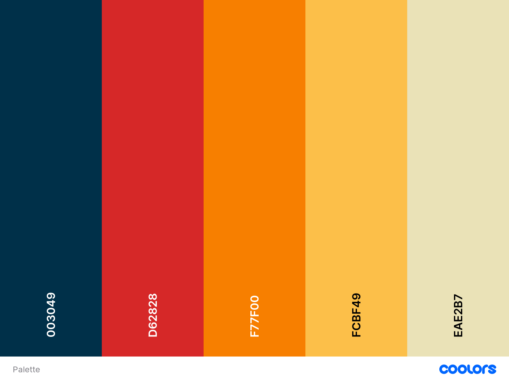

# Thesis Management 

- [Thesis Management](#thesis-management)
  - [Run instructions](#run-instructions)
  - [Login credentials (main users)](#login-credentials-main-users)
  - [API Server](#api-server)
    - [`/api/proposals`:](#apiproposals)
    - [`/api/degrees`:](#apidegrees)
    - [`/api/groups`:](#apigroups)
    - [`/api/teachers`:](#apiteachers)
    - [`/api/students`:](#apistudents)
    - [`/api/keywords`:](#apikeywords)
    - [`/api/applications`:](#apiapplications)
    - [`/api/levels`:](#apilevels)
    - [`/api/career`:](#apicareer)
    - [Others](#others)
      - [Keywords](#keywords)
  - [Database Tables](#database-tables)
    - [Tables](#tables)
      - [`ProposalKeywords`](#proposalkeywords)
      - [`Keywords`](#keywords-1)
      - [`Courses`](#courses)
      - [`Departments`](#departments)
      - [`Degrees`](#degrees)
      - [`Groups`](#groups)
      - [`Users`](#users)
      - [`Teachers`](#teachers)
      - [`Careers`](#careers)
      - [`Students`](#students)
      - [`Supervisors`](#supervisors)
      - [`Proposals`](#proposals)
      - [`ProposalRequests`](#proposalrequests)
      - [`ProposalRequestCoSupervisors`](#proposalrequestcosupervisors)
      - [`Applications`](#applications)
  - [Client main pages](#client-main-pages)
    - [General](#general)
      - [Components](#components)
    - [Student](#student)
      - [Components](#components-1)
    - [Teacher](#teacher)
      - [Components](#components-2)

## Run instructions
In order to run the application you need to open two terminals and run:
- `cd client; npm install; npm run dev` in the first one;
- `cd server; npm install; node index.js` in the other one.

## Login credentials (main users)
|username|password|
|---|---|
|d10000@polito.it | 10000 |
|d10001@polito.it | 10001 |
|d10002@polito.it | 10002 |
|s308692@studenti.polito.it | 308692 |
|s318082@studenti.polito.it | 318082 |
|s312121@studenti.polito.it | 312121 |
|s314948@studenti.polito.it | 314948 |
|s309164@studenti.polito.it | 309164 |
|s312401@studenti.polito.it | 312401 |

## API Server

### `/api/proposals`:

- POST `/`
  - request body content: all the fields for the proposal:
  - response: 
    - 200 OK (success)
    - 500 Internal Server Error: Indicates an error during processing.
```json
{
    "title": "DevOps proposal",
    "type":"Innovation that inspires",
    "description": "This is a DevOps proposal.",
    "level": "MSc",
    "expiration_date": "2023-12-22",
    "notes": "No additional notes",
    "required_knowledge": "Student must know the principle of software development.",
    "cod_degree": ["2", 3],
    "cod_group": "1",
    "supervisors_obj": {
        "supervisor_id": 10000,
        "co_supervisors": [
            10001,
            10002
            ],
        "external":[{
          "name":"Franco",
          "surname":"Solo",
          "email":"franco.solo@devops.com"
        },]
    },
    "keywords": [
        "Javascript"
    ]
}
```

- DELETE `/:id`
  - request body content: none
  - response: 
    - 200 OK (success)
    - 500 Internal Server Error: Indicates an error during processing.

- GET `/`
  - Description: Retrieve a list of proposals based on specified filters.
  - Query Parameters:
    - `cod_degree (required):` The code of the degree associated with the proposals.
    - `start_date (optional)`: The start date for filtering proposals (format: YYYY-MM-dd).
    - `end_date (optional)`: The end date for filtering proposals (format: YYYY-MM-dd).
    - `supervisor_id (optional)`: The ID of the supervisor for additional filtering.
    - `keyword_ids (optional)`: An array of keyword IDs for further filtering.
    - `level_ids (optional)`: An array of level IDs for additional filtering.
  - Response:
    - 200 OK: Successfully retrieves and returns a list of proposals.
    - 400 Bad Request: Indicates missing or invalid parameters.
    - 500 Internal Server Error: Indicates an error during processing.
    ```json
    // the response
    [
      {
        "id": 27,
        "title": "Computer vision techniques for mobile testing",
        "description": "Many End-to-End (E2E) testing tools allow developers to create repeatable test scripts.",
        "expiration_date": "2024-07-31",
        "cod_degree": "2",
        "title_degree": "COMMUNICATIONS ENGINEERING",
        "level": "MSc",
        "supervisor_id": 10000,
        "notes": "http://grains.polito.it/work.php",
        "cod_group": 1,
        "title_group": "Elite",
        "required_knowledge": "programming skills (Python, deep learning frameworks);\r\nexperience in training deep neural networks;\r\nfundamentals of mobile development (Android GUI, the Android Studio development environment);",
        "keyword_names": "AI, Mobile Application",
        "supervisorsInfo": [
          {
            "id": 10000,
            "name": "Mario",
            "surname": "Rossi",
            "email": "d10000@polito.it",
            "cod_group": 1
          },
          {
            "id": 10001,
            "name": "Giuseppe",
            "surname": "Verdi",
            "email": "d10001@polito.it",
            "cod_group": 1
          }
        ]
      }, 
    ]
    ```

- GET `/teachers/:id`
  - request body content: none
  - response: 
    - 200 OK (success) with array of thesis proposals object 
    - 400 Bad Request if the id is of unknown teachers
    - 401 Unauthorized (failure) with error message
    - 500 Internal Server Error: Indicates an error during processing.
```json
[
  {
    "id": 15,
    "title": "Thesis proposal IV",
    "description": "This is an innovative proposal.",
    "type": "Innovation that inspires",
    "level": "MSc",
    "expiration_date": "2024-03-01T00:00:00+01:00",
    "notes": "No additional notes",
    "cod_degree": 2,
    "cod_group": 1,
    "required_knowledge": "Student must know the principle of design of mobile applications.",
    "status": "posted",
    "title_degree": "COMMUNICATIONS ENGINEERING",
    "title_group": "Elite"
  },
]
```

- PUT `/:proposalId`
  - Description: Update the status of an application
  - request body content: 
    - see below
  - response:
    - 204 No Content: Successfully updated.
    - 400 Bad Request: Indicates missing or invalid parameters.
    - 401 Unauthorized: Indicates that the user is not logged in.
    - 403 Forbidden: User cannot access to this resource.
    - 404 Not Found: The proposal doesn't exist.
    - 500 Internal Server Error: Indicates an error during processing.
  ```json
  {
    "title": "Some proposal",
    "type":"A proposal that inspires",
    "description": "This is a fake proposal.",
    "level": "MSc",
    "expiration_date": "2023-12-22",
    "notes": "additional notes",
    "required_knowledge": "Student must know the principle of software development.",
    "cod_degree": ["5"],
    "cod_group": "1",
    "supervisors_obj": {
        "supervisor_id": 10000,
        "co_supervisors": [
            10001,
            10002
            ]
    },
    "keywords": [
        "AI", "Java", "Web development"
    ]
  }
  ```

- GET `/:proposalId`
  - request body: none
  - response:
    - 200 OK (success) with array of thesis proposals object 
    - 401 Unauthorized (failure) with error message
    - 403 Forbidden
    - 404 If the proposal is not found
    - 500 Internal Server Error: Indicates an error during processing.
```json
{
  "id": 27,
  "title": "Computer vision techniques for mobile testing",
  "description": "Many End-to-End (E2E) testing tools allow developers to create repeatable test scripts.",
  "type": "Tesi esterna in azienda",
  "level": "MSc",
  "expiration_date": "2024-07-31",
  "notes": "http://grains.polito.it/work.php",
  "cod_degree": 2,
  "required_knowledge": "programming skills (Python, deep learning frameworks);\r\nexperience in training deep neural networks;\r\nfundamentals of mobile development (Android GUI, the Android Studio development environment);",
  "status": "assigned",
  "title_degree": "COMMUNICATIONS ENGINEERING",
  "groups": [
    {
      "cod_group": 2,
      "title_group": "Automatica"
    },
    {
      "cod_group": 3,
      "title_group": "EMC Group"
    },
    {
      "cod_group": 1,
      "title_group": "Elite"
    }
  ],
  "keywords": [
    "AI"
  ],
  "coSupervisors": [
    {
      "id": 10001,
      "name": "Giuseppe",
      "surname": "Verdi",
      "email": "d10001@polito.it"
    },
    {
      "id": 10004,
      "name": "Franco",
      "surname": "Francini",
      "email": "d10004@polito.it"
    }
  ]
}
```
- POST `/request`
  - request body content: 
    - see below
  - response: 
    - 201 Created
    - 400 Errors in the body object
    - 500 Internal Server Error: Indicates an error during processing.
```json
{
  "title": "A title",
  "type": "Research",
  "description": "A description related to the activity",
  "notes": "Some additional notes about the thesis work",
  "teacherEmail": "john.doe@polito.it",
  "coSupervisorEmails": [
    "mario.rossi@polito.it",
    "giuseppe.verdi@polito.it"
  ]
} 
```

### `/api/degrees`:

- GET `/`
  - request body content: none
  - response: 
    - 200 OK (success) with degree object or error message
    - 500 Internal Server Error: Indicates an error during processing.
```json
[ {
    "cod_degree": 1,
    "title_degree": "AUTOMOTIVE ENGINEERING (INGEGNERIA DELL'AUTOVEICOLO)",
    "level_degree": "MSc"
  }, ]
```

### `/api/groups`:

- GET `/`
  - request body content: none
  - response: 
    - 200 OK (success) with object or error message
    - 500 Internal Server Error: Indicates an error during processing.
```json
  [ {
    "cod_group": 0,
    "cod_department": "ICM",
    "title_group": "Softeng"
  }, ]
```

### `/api/teachers`:
- GET `/`
  - request body content: none
  - response: 
    - 200 OK (success) with teachers or error message
    - 500 Internal Server Error: Indicates an error during processing.
```json
  [   {
    "teacher_id": 10000,
    "name": "Marco",
    "surname": "Torchiano",
    "email": "torchiano@polito.it",
    "cod_group": 7,
    "cod_department": "DAUIN"
  }, ]
```
- GET `/:id`
  - request body content: none
  - response: 
    - 200 OK (success) with the *teacher* with the corresponding `id` or error message
    - 404 if the user is not found
    - 500 Internal Server Error: Indicates an error during processing.
```json
{
  "id": 10000,
  "surname": "Torchiano",
  "name": "Marco",
  "email": "torchiano@polito.it",
  "cod_group": 7,
  "cod_department": "ICM",
  "group_name": "Softeng"
}
```

### `/api/students`:

- GET `/:id`
  - request body content: none
  - response: 
    - 200 OK (success) with the *student* with the corresponding `id` or error message
    - 404 if the user is not found
    - 500 Internal Server Error: Indicates an error during processing.
```json
{
  "student_id": 400000,
  "name": "Mario",
  "surname": "Rossi",
  "gender": "M",
  "nationality": "italian",
  "email": "mario.rossi@studenti.polito.it",
  "cod_degree": 5,
  "enrollment_year": 2022
}
```

### `/api/keywords`:

- GET `/`
  - request body content: none
  - response: 
    - 200 OK (success) with teachers or error message
    - 500 Internal Server Error: Indicates an error during processing.
```json
  [ {
    "id": 1,
    "name": "AI"
  }, ]
```

### `/api/applications`:

- GET `/proposal/:id`
  - request body content: none
  - response: 
    - 200 OK (success) with the list of applications or error message
    - 500 Internal Server Error: Indicates an error during processing.
  ```json
  [
    {
      "student_id": 400000,
      "submission_date": "2023-10-12",
      "student_name": "Mario",
      "student_surname": "Rossi",
      "student_email": "mario.rossi@studenti.polito.it",
      "student_nationality": "italian",
      "student_enrollment_year": 2022,
      "student_title_degree": "COMPUTER ENGINEERING"
    },
  ]
  ```
  - GET `/proposal/`
  - request body content: none
  - response: 
    - 200 OK (success) with the list of applications of that student or error message
    - 500 Internal Server Error: Indicates an error during processing.
  ```json
  [
    {
      "id": 4,
      "title": "thesis",
      "description": "description55",
      "expiration_date": "2023-11-19T00:00:00+01:00",
      "cod_degree": "5",
      "title_degree": "COMPUTER ENGINEERING",
      "level": "MSc",
      "supervisor_id": 10000,
      "notes": "notes",
      "cod_group": 1,
      "title_group": "Elite",
      "required_knowledge": "softeng2 exam",
      "keyword_names": "Javascript",
      "keyword_types": "KEYWORD",
      "status": "submitted",
      "supervisorsInfo": [
        {
          "id": 10000,
          "name": "Mario",
          "surname": "Rossi",
          "email": "d10000@polito.it",
          "cod_group": 1
        },
        {
          "id": 10001,
          "name": "Giuseppe",
          "surname": "Verdi",
          "email": "d10001@polito.it",
          "cod_group": 1
        }
      ]
    }
  ]
  ```
- POST `/`
  - Description: Create a new application for a proposal.
  - Request Body:
      - `proposal_id`
      - `student_id`
      - `submission_date`
  - Response:
    - 200 OK: Application successfully created.
    - 400 Bad Request: Indicates missing or invalid parameters.
    - 500 Internal Server Error: Indicates an error during processing.
  ```json
  {
    "application_id": 123,
    "proposal_id": 1,
    "student_id": 1001,
    "submission_date": "2023-11-18"
  }
  ```

- PUT `/:applicationId`
  - Description: accept or reject an application made by a student
  - Request Body:
    - `status`
  - Response:
    - 204 No Content: successfully updated.
    - 400 Bad Request: Indicates missing or invalid parameters.
    - 401 Unauthorized: Indicates that the user is not logged in.
    - 403 Forbidden: User cannot access to this resource.
    - 404 Not Found: The application doesn't exist.
    - 500 Internal Server Error: Indicates an error during processing.
  ```json
  {
    "status":"accepted"
  }
  // or
  {
    "status":"rejected"
  }
  ```

### `/api/levels`:

- GET `/`
  - request body content: none
  - response: 
    - 200 OK (success) with degree object or error message
    - 500 Internal Server Error: Indicates an error during processing.
```json
[
  {
    "id": "MSc",
    "name": "MSc"
  },
] 
```

### `/api/career`:
- GET `/student/:studentId`
  - request body content: none
  - response:
    - 200 OK (success) with career informations
    - 400 Bad Request (error) with an error message
    - 500 Internal Server Error: indicates an error during processing
```json
[
  {
    "id": 318082,
    "cod_course": "03RUMPQ",
    "title_course": "Urbanism",
    "cfu": 10,
    "grade": 30,
    "date": "2023-12-01"
  },
]
```

- POST `/upload/student/:studentId/application/:applicationId`
  - request body content: 
    - `formData`
  - response:
    - 200 OK (success) with a successful message and the file uploaded successfully
    - 400 Bad Request (error) with an error message
    - 500 Internal Server Error: indicates an error during processing
```json
[
  {
    "message": "File uploaded successfully.",
    file
  }
]
```

- GET `/download/student/:studentId/application/:applicationId`
  - request body content: none
  - response: 
    - 200 OK (success) with information if the file exists and in case of it exists the file url
    - 400 Bad Request (error) with an error message
    - 500 Internal Server Error: indicates an error during processing
```json
[
  {
    "fileExists": true,
    "fileUrl": "http://localhost:3001/students_CV/${file}"
  }
]
//or
[
  {
    "fileExists": false
  }
] 
```

### Others
#### Keywords
- `postKeyword(keywordName)`: post a new keyword in the database (path: `services/keyword.services.js`)
- `getKeywordByName(keywordName)`: if exists, it returns a keyword with the specified name (path: `services/keyword.services.js`)

## Database Tables
The database can be found in: `./server/database.db`.
### Tables
#### `ProposalKeywords`
- proposal_id: INTEGER (NOT NULL)
- keyword_id: INTEGER (NOT NULL)
  
#### `Keywords`
- id: INTEGER
- name: TEXT (NOT NULL, UNIQUE)
- type: TEXT (NOT NULL)

#### `Courses`
- cod_course: TEXT
- title_course: INTEGER

#### `Departments`
- cod_department: TEXT (NOT NULL)
- title_department: TEXT (NOT NULL)

#### `Degrees`
- cod_degree: INTEGER
- title_degree: TEXT

#### `Groups`
- cod_group: INTEGER (NOT NULL)
- cod_department: TEXT (NOT NULL)
- title_group: TEXT (NOT NULL)

#### `Users`
- id: INTEGER (NOT NULL, UNIQUE)
- email: INTEGER (NOT NULL)
- name: TEXT (NOT NULL)
- surname: TEXT (NOT NULL)
- role: TEXT (NOT NULL)

#### `Teachers`
- id: INTEGER
- name: TEXT
- surname: TEXT
- email: TEXT
- cod_group: INTEGER
- cod_department: TEXT
  
#### `Careers`
- id: INTEGER (NOT NULL)
- cod_course: TEXT
- title_course: TEXT
- cfu: INTEGER
- grade: INTEGER
- date: TEXT

#### `Students`
- id: INTEGER
- name: TEXT
- surname: TEXT
- gender: TEXT
- nationality: TEXT
- email: TEXT
- cod_degree: INTEGER
- enrollment_year: INTEGER

#### `Supervisors`
- proposal_id: INTEGER
- supervisor_id: INTEGER
- co_supervisor_id: INTEGER
- external_supervisor: INTEGER
  
#### `Proposals`
- id: INTEGER
- title: TEXT
- type: TEXT
- description: TEXT
- level: TEXT (one between "MSc" and "BSc")
- expiration_date: TEXT
- notes: TEXT
- cod_degree: TEXT (NOT NULL)
- cod_group: INTEGER
- required_knowledge: TEXT
- status: TEXT (DEFAULT 'posted')
  - other values:
    - `assigned`: if a student application has been accepted
    - `archived`: if the proposal has been archived or has expired

#### `ProposalRequests`
- id: INTEGER
- student_id: INTEGER
- teacher_id: INTEGER
- title: TEXT
- description: TEXT
- notes: TEXT
- type: TEXT

#### `ProposalRequestCoSupervisors`
- proposal_request_id: INTEGER
- co_supervisor_id: INTEGER

#### `Applications`
- application_id: INTEGER (AI)
- proposal_id: INTEGER (NOT NULL)
- student_id: INTEGER (NOT NULL)
- status: TEXT (DEFAULT 'submitted', OTHERS 'accepted', 'refused')
- submission_date: TEXT

## Client main pages
Official palette:

### General
- `InitialPage.jsx`: Contains the redirect mechanisms to the login page to be performed with SAML2.0 technologies.
- `NotFoundPage.jsx`: Landing page in case the url is incorrect.

#### Components
- `AlertDialog.jsx`: Is a popup window that displays the information about a thesis or a student.
- `ConfirmationDialog.jsx`: Is a popup window that asks for confirmation. To correctly work, it is necessary to pass ALL the following properties:
  - `open`: boolean;
  - `onClose`: what to do when the popup is closed;
  - `onConfirm`: returns `true` if the operation is *completed*, `false` otherwise;
  - `message`: the message to display ("Are you sure you want to...");
  - `operation`: the operation to be performed ("send", "apply", ...) [this text is displayed in the button label];
- `ClockCustomized.jsx`: implements the logic of the virtual clock which allows move forward in the time to see the status of the system in a future day (with the current data).
- `CustomSnackbar.jsx`: it returns a Snackbar component with the `open` state, auto hide duration, `handleClose` function, and `action` as its props. Inside the `Snackbar`, there is an `Alert` component that displays the `props.message.text` and has a severity based on the `props.message.type`.
- `ChipsCustomized.jsx`: it receives props including an `array`, a `selectedArray`, and a `setSelectedArray` function. Inside the component, there is a `handleClick` function that takes a `chipToSelect` parameter. If the `chipToSelect` is already in the `selectedArray`, it is removed from the `selectedArray`, otherwise, it is added to the `selectedArray`.  
The component returns a JSX structure that renders a list of chips based on the input array. Each chip has a `label`, an `onClick` event that calls the `handleClick` function with the chip's data, and a `color` that depends on whether the chip is selected or not.

- `Autocomplete.jsx`: it allows users to select multiple options from a list. It is customized with various props such as `options` (the available options), `limitTags` (the maximum number of selected tags to display), `getOptionLabel` (a function to determine the label for each option), and more. It also specifies a `value` prop to set the selected value and an `onChange` prop to handle changes to the selected value.
- `MenuButton.jsx`: it generates a menu button component based on the user's role. The component takes in a props object with a `userRole` property, which represents the role of the user. Depending on the user's role, different menu items are added to the `menuList` array. When a menu item is clicked, the `handleClick` function is called, which uses the `userRole` and the clicked index to determine the appropriate path to navigate to.
### Student
- `MainPage.jsx`: Is the main page of the student. It is the one displayed right after logging in.
- `StudentApplications.jsx`: It is the page from which the user can navigate through the list of his applications to the theses proposals.

#### Components
- `ProposalStudent.jsx`: It is the component through which the student can propose a thesis work to the secretary and to a professor.
- `FilterComponent.jsx`: It is the component through which the student can filter the theses in the page in which they are displayed.
- `MainDashboard.jsx`: render the `TableComponent.jsx`.
- `TableComponent.jsx`: It is the component used both for showing the proposals available on the website and for showing the application status made by students.

### Teacher
- `TeacherPage.jsx`: Is the main page of the teacher. It is displayed right after the login, and within the page the teacher can check the status of her proposals (archived, applications received) and inserting a new one by clicking on the button.

#### Components
- `ProposalTeacher.jsx`: It is the component through which the teacher can add a new thesis proposal from scratch or starting by an existing one, and it also handles the editing/updating part of an existing proposal (if it has not been assigned to any student).
- `CollapsibleTable.jsx`: It is the component in which the proposals of the teacher (logged in) are shown. From that list it is possible to access the informations related to that proposal, executing some actions (archive, edit, delete) and see the list of applications made by students to that proposal.
