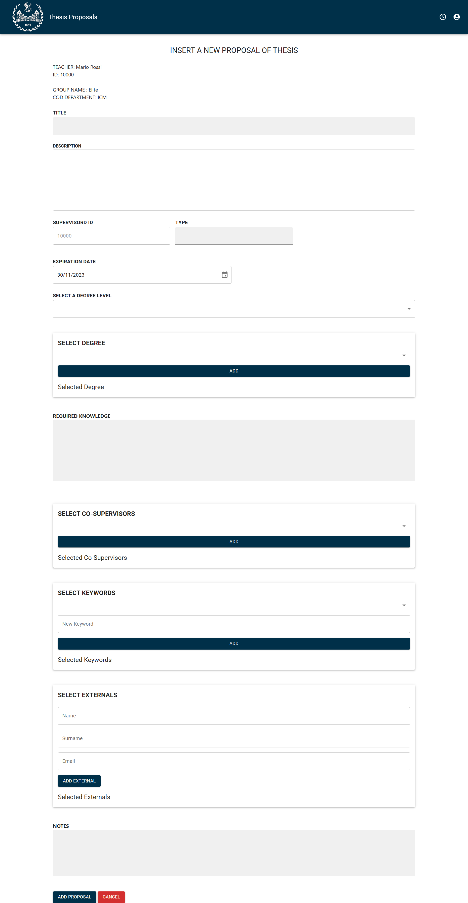
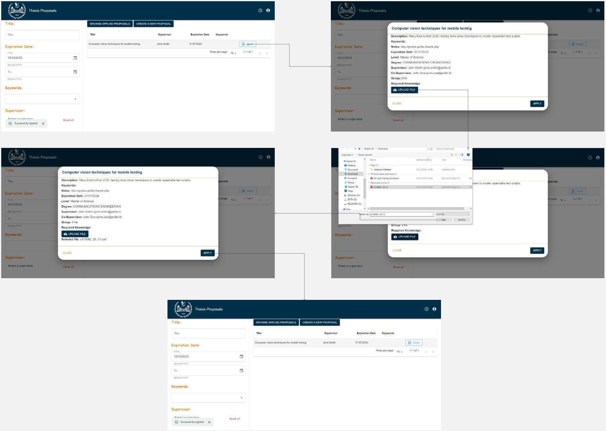

# E2E Tests

## Login Page

Professor and student both log in on this page and according to the user's role, they are transferred to the professor's or student's dashboard.

## Teacher Dashboard

On this page, the professor can see the proposals he has created. It can also filter proposals based on whether they are posted or assigned. It can also modify the proposal with buttons synced with delete, archive and edit actions.

### Proposal Details

By clicking on view details for each proposal, a modal opens that shows the details of the proposal such as keywords, descriptions and required knowledge.

### Assigned Proposal

By applying this filter, proposal actions such as delete and edit are disabled.

### Applications of proposal

By clicking on each arrow, the row of the table will expand and the applications for which the proposal has been sent can be seen along with the status, in this part the teacher can make a decision for the sent applications.

### Insert new proposal

The professor can create a new proposal on this page

## Student Dashboard

### Browse Applications

The applications made by a student for different proposals along with the status of each application (sent, rejected, approved) are shown on this page.

### Search Proposals

Students can search for their desired proposal by title, expiration date, supervisor, and keywords.

### Access Applicant CV

#### Student can upload a file when he/she applies for a proposal

#### Professor can see the career of the student and his cv file

### Insert Student Request

#### A student can create a new thesis proposal

### Search Archive

#### A professor can see the archived thesis proposal

### Copy Proposal

#### A professor can create a new proposal starting from an existing proposal

### View Notifications

#### All the users can see their notifications

### Browse Co-Supervised Proposals

#### A professor can sees all the proposals in which he is the co-supervisor

### Secretary Approve Student Requests

#### A secretary can approve or reject students requests

### Professor Approve Student Requests

#### A professor can approve, reject or request change in a student request after it has been approved by the secretary

### Add academic co-supervisor

#### A professor can add a new co-supervisor to a proposal

### Student Request from Application

#### A student can do a new request from an approved application

